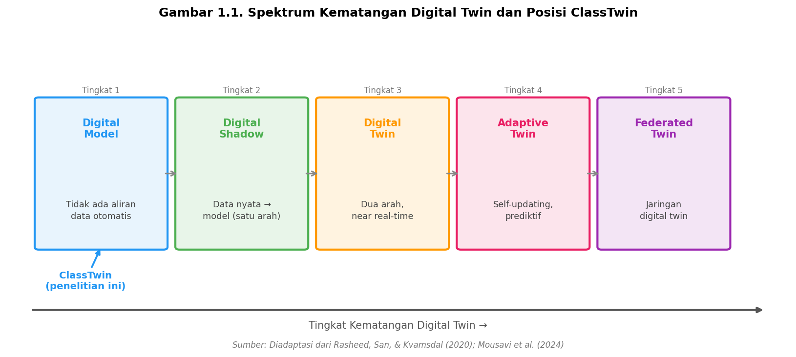
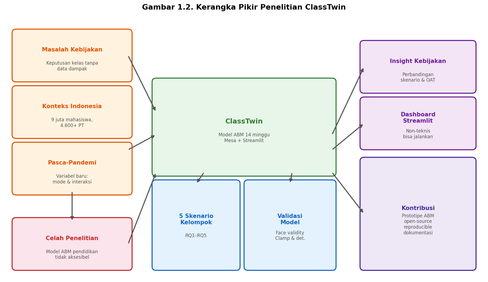

## BAB I: PENDAHULUAN

### 1.1 Latar Belakang

Ruang kelas di perguruan tinggi bukan sekadar tempat transfer ilmu. Di dalamnya, capaian belajar mahasiswa dibentuk oleh banyak lapisan sekaligus: kemampuan dan motivasi individu, cara dosen mengajar dan memberi umpan balik, dinamika sosial antar mahasiswa, tekanan akademik dari luar kelas, hingga kondisi fisik ruangan itu sendiri. Semua faktor ini bekerja bersamaan, saling memengaruhi, dan menghasilkan pola yang tidak selalu mudah diprediksi. Itulah yang membuat keputusan kebijakan di level program studi — ukuran kelas, batas waktu pengembalian tugas, program tutoring, mode perkuliahan — jauh lebih berdampak dari yang sering diasumsikan, sekaligus sulit dievaluasi tanpa data yang memadai.

Di Indonesia, lebih dari 9 juta mahasiswa tersebar di lebih dari 4.600 perguruan tinggi (DIKTI, 2023). Angka putus studi (*dropout*) mahasiswa S1 di Indonesia mencapai sekitar 7% per tahun, dengan penyebab utama berupa tekanan akademik, faktor ekonomi, dan rendahnya keterlibatan mahasiswa dalam proses pembelajaran (Kemdikbudristek, 2022). Setiap semester, kepala program studi di seluruh kampus membuat keputusan-keputusan yang secara langsung memengaruhi pengalaman belajar ribuan mahasiswa: berapa batas kapasitas kelas yang layak, berapa lama dosen diperkenankan mengembalikan nilai tugas, apakah perkuliahan sebaiknya dijalankan luring, daring, atau hibrida. Pada kenyataannya, sebagian besar keputusan ini diambil berdasarkan pertimbangan logistik dan keterbatasan anggaran, bukan atas dasar data tentang dampaknya terhadap kinerja mahasiswa.

Situasi ini semakin kompleks pasca-pandemi COVID-19. Lonjakan perkuliahan daring sejak 2020 memperkenalkan variabel-variabel yang sebelumnya tidak pernah dikelola secara sistematis: interaksi berbasis layar, berkurangnya rasa kebersamaan dalam kelas, dan jenis tekanan psikologis yang berbeda dari perkuliahan tatap muka. Penelitian sebelumnya telah menunjukkan bahwa mode perkuliahan memengaruhi hasil belajar secara terukur, meskipun pengaruhnya bergantung pada desain pembelajaran dan dukungan institusi (Means et al., 2010). Fakta bahwa transisi ke daring terjadi secara mendadak dan masif memperkuat kebutuhan akan alat yang bisa membantu pengelola program studi memahami konsekuensi kebijakan sebelum diterapkan.

Di sisi lain, *Learning Management System* (LMS) seperti SPADA, Moodle, dan platform sejenis kini menghasilkan data perilaku belajar yang melimpah di kampus-kampus Indonesia: log akses materi, waktu pengumpulan tugas, frekuensi interaksi forum, dan rekam jejak nilai. Sayangnya, data ini sebagian besar belum dimanfaatkan untuk mendukung pengambilan keputusan kebijakan. Kepala program studi non-teknis jarang memiliki akses ke alat analisis yang bisa mengolah data LMS menjadi rekomendasi kebijakan yang konkret. Jembatan antara data yang tersedia dan keputusan yang perlu diambil belum banyak tersedia (Romero & Ventura, 2007).

Konsep *digital twin* menawarkan satu pendekatan untuk membangun jembatan itu. Pertama kali diformalkan dalam rekayasa industri oleh Grieves (2014), sebuah *digital twin* adalah representasi virtual dari sistem nyata yang memungkinkan eksperimentasi tanpa menyentuh sistem aslinya. Rasheed, San, dan Kvamsdal (2020) merumuskan spektrum kematangan *digital twin* mulai dari *digital model* sederhana hingga *digital twin* penuh yang terhubung secara real-time dengan sistem fisiknya. Dalam konteks kelas universitas, ClassTwin diposisikan secara eksplisit pada tingkat pertama spektrum ini — yaitu *digital model* — karena parameter-parameter model belum dikalibrasi dari data kelas nyata. Meskipun demikian, bahkan *digital model* tingkat pertama sudah cukup berguna untuk analisis kebijakan eksploratif: kepala program studi bisa mengajukan pertanyaan seperti "Apa yang terjadi pada IPK rata-rata jika kuota kelas dinaikkan dari 30 menjadi 60 mahasiswa?" atau "Apakah program tutoring empat minggu cukup untuk menurunkan angka kegagalan?", dan mendapat gambaran yang masuk akal sebelum kebijakan itu diterapkan di kelas nyata. Posisi ClassTwin dalam spektrum ini bukan keterbatasan yang perlu disembunyikan, melainkan **langkah awal yang disengaja** dalam roadmap pengembangan bertahap menuju *digital twin* penuh yang terhubung dengan data LMS aktual.

*Gambar 1.1. Spektrum kematangan digital twin dan posisi ClassTwin sebagai digital model tingkat pertama. Sumber: Diadaptasi dari Rasheed, San, & Kvamsdal (2020); Mousavi et al. (2024).*

Simulasi berbasis agen (*Agent-Based Simulation*, ABS) adalah paradigma komputasional yang paling sesuai untuk membangun model semacam ini. Dalam ABS, setiap entitas direpresentasikan sebagai agen otonom — mahasiswa dan dosen — yang masing-masing memiliki atribut dan aturan perilaku sendiri. Interaksi antar agen menghasilkan pola-pola di tingkat sistem yang tidak bisa diprediksi langsung dari perilaku individu, atau yang dikenal sebagai *emergent behavior* (Wilenski & Rand, 2015). Keunggulan utama ABS dibanding model regresi atau sistem dinamis adalah kemampuannya merepresentasikan heterogenitas individu secara eksplisit (Squazzoni, 2012): tidak semua mahasiswa memiliki kapasitas belajar yang sama, tidak semua berasal dari keluarga dengan dukungan ekonomi setara, dan tidak semua merespons tekanan akademik dengan cara yang identik.

Penelitian terdahulu di bidang ABS pendidikan mencakup simulasi dropout mahasiswa (Raga & Raga, 2002), model motivasi belajar berbasis teori SDT (Azevedo, 2015), serta simulasi efek ukuran kelas terhadap interaksi guru-murid (Maroulis & Wilensky, 2008). Namun, sebagian besar model tersebut memiliki kelemahan yang sama: aksesibilitas rendah, tidak dilengkapi antarmuka untuk pengguna non-teknis, dan jarang disertai mekanisme reprodusibilitas yang ketat (Macal & North, 2010). Belum ada prototipe ABS kelas universitas yang menggabungkan konfigurabilitas kebijakan penuh, validasi akademik, dan *dashboard* interaktif dalam satu paket *open-source* — khususnya untuk konteks perguruan tinggi Indonesia.

Kesenjangan inilah yang menjadi dasar penelitian ini. Penelitian ini merancang dan mengimplementasikan prototipe *Classroom Ecosystem Digital Twin* (ClassTwin): simulasi berbasis agen yang sepenuhnya dapat dikonfigurasi, dapat direproduksi dengan *random seed* yang tetap, dan dilengkapi *dashboard* Streamlit agar dapat dijalankan tanpa perlu menulis kode. Prototipe ini bukan model prediktif, melainkan alat eksplorasi kebijakan yang memungkinkan pembandingan skenario "bagaimana jika" dengan biaya rendah sebelum keputusan diterapkan di kelas nyata.

*Gambar 1.2. Kerangka pikir penelitian: dari permasalahan kebijakan kelas menuju model ABS (ClassTwin), eksperimen skenario, dan wawasan berbasis data.*

---

### 1.2 Rumusan Masalah

Berdasarkan latar belakang di atas, rumusan masalah dalam penelitian ini adalah sebagai berikut:

1. Apakah ukuran kelas yang lebih besar berkorelasi dengan penurunan kinerja akademik rata-rata dalam simulasi?
2. Apakah pengurangan keterlambatan umpan balik dan pengurangan beban tugas meningkatkan hasil belajar mahasiswa dalam simulasi?
3. Apakah intervensi tutoring yang ditargetkan pada 25% mahasiswa terbawah secara terukur mempersempit kesenjangan pengetahuan dalam simulasi?
4. Apakah kohort dengan keberagaman status sosial ekonomi (SES) yang tinggi menghasilkan kesenjangan IPK antar-kuartil yang lebih besar dalam simulasi?
5. Apakah faktor lingkungan fisik (suhu ruangan) dan mode perkuliahan (tatap muka, hibrida, daring) berdampak terukur terhadap hasil belajar mahasiswa dalam simulasi?

---

### 1.3 Tujuan Penelitian

Penelitian ini memiliki tujuan-tujuan sebagai berikut:

1. Merancang dan mengimplementasikan model simulasi berbasis agen untuk ekosistem kelas universitas satu semester (14 minggu) dengan agen mahasiswa (*StudentAgent*) dan agen dosen (*LecturerAgent*).
2. Mendefinisikan lima kelompok skenario eksperimen yang mencakup rumusan masalah pertama hingga kelima dengan parameter yang jelas dan dapat direproduksi.
3. Menjalankan eksperimen skenario dan menganalisis perbedaan capaian antar-skenario untuk menjawab masing-masing rumusan masalah.
4. Melakukan analisis sensitivitas *one-at-a-time* (OAT) untuk mengidentifikasi faktor kebijakan yang paling berpengaruh terhadap hasil simulasi.
5. Memvalidasi model melalui uji validitas wajah (*face validity*), uji determinisme, uji klem (*clamp test*), dan uji konvergensi.
6. Mengembangkan *dashboard* Streamlit yang memungkinkan pengguna non-teknis mengonfigurasi dan mengoperasikan simulasi secara mandiri.

---

### 1.4 Batasan Penelitian

Agar penelitian ini terfokus, ditetapkan batasan-batasan berikut:

1. **Tidak ada kalibrasi data nyata.** Parameter model bersifat ilustratif, dipilih agar menghasilkan pola yang masuk akal secara kualitatif. Kalibrasi dengan data LMS nyata merupakan pekerjaan masa depan.
2. **Simulasi satu mata kuliah.** Model tidak merepresentasikan rantai kurikulum, prasyarat antar-mata-kuliah, atau beban studi dari mata kuliah lain yang diambil mahasiswa secara bersamaan.
3. **Satu agen dosen.** Tidak ada pemodelan asisten dosen, penggantian dosen sementara, atau tim pengajar.
4. **Model putus studi sederhana.** Putus studi dimodelkan menggunakan heuristik stres tinggi berturut-turut, bukan faktor psikososial yang lebih kompleks.
5. **Kelompok belajar bersifat statis.** Jaringan pertemanan dan kelompok belajar ditetapkan di awal semester dan tidak berubah sepanjang simulasi.
6. **Tekanan eksternal sebagai skalar tunggal.** Faktor-faktor seperti pekerjaan paruh waktu, kewajiban keluarga, dan kesehatan mental direpresentasikan hanya sebagai satu parameter tekanan eksternal, bukan variabel individual yang terpisah.

---

### 1.5 Manfaat Penelitian

**Manfaat teoritis:**
Penelitian ini berkontribusi pada literatur ABS dalam pendidikan dengan menghadirkan prototipe *classroom digital twin* yang sepenuhnya dapat direproduksi dan *open-source*. Tidak seperti kebanyakan model ABS pendidikan yang ada, prototipe ini menggabungkan konfigurabilitas kebijakan, validasi akademik, dan antarmuka yang dapat digunakan langsung oleh praktisi.

**Manfaat praktis:**
- *Bagi kepala program studi:* Tersedia alat analisis kebijakan virtual untuk mengevaluasi dampak perubahan ukuran kelas, kecepatan umpan balik, atau mode perkuliahan sebelum diterapkan di kelas nyata.
- *Bagi peneliti pendidikan:* Prototipe ini menyediakan kerangka dasar yang dapat diperluas dan dikalibrasi dengan data LMS nyata pada penelitian lanjutan.
- *Bagi pengembang perangkat lunak pendidikan:* Arsitektur berbasis konfigurasi dan antarmuka Streamlit yang disertakan dapat dijadikan referensi implementasi yang dapat diadaptasi.
