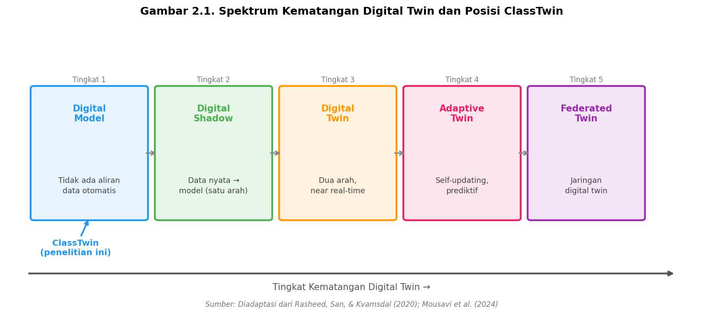
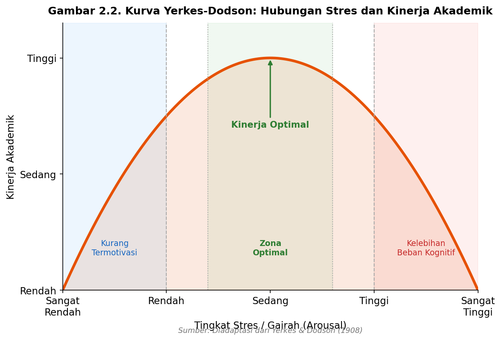
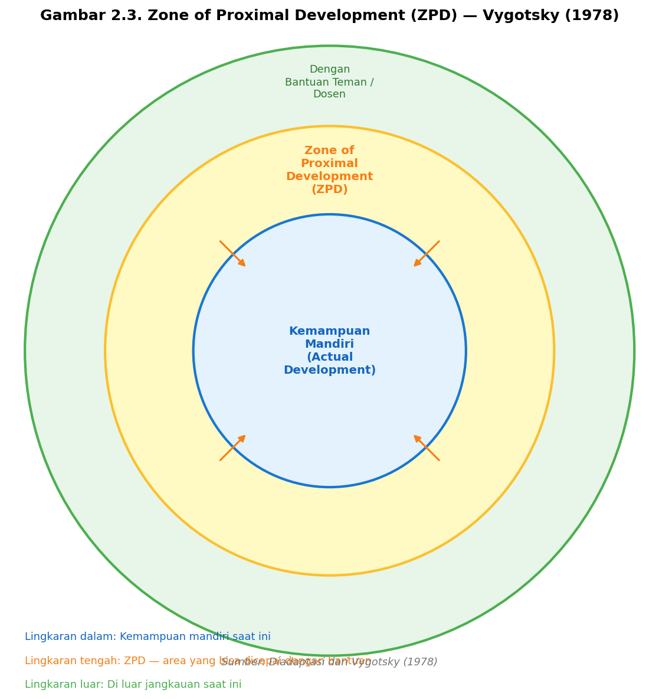

## BAB II: KAJIAN PUSTAKA

### 2.1 Tinjauan Pustaka

Tinjauan pustaka merangkum penelitian-penelitian terdahulu yang relevan dengan topik penelitian ini, mencakup simulasi berbasis agen dalam pendidikan, konsep *digital twin*, faktor psikologis yang memengaruhi kinerja mahasiswa, serta pendekatan analisis data pembelajaran.

**Tabel 2.1: Penelitian Terdahulu**

| No | Penulis / Tahun | Judul Penelitian | Metode Penelitian | Hasil dan Kesimpulan | Kekurangan / Kesenjangan |
|---|---|---|---|---|---|
| 1 | Bonabeau (2002) | Agent-Based Modeling: Methods and Techniques for Simulating Human Systems | Kajian konseptual & review | ABM mampu merepresentasikan perilaku adaptif manusia; menghasilkan *emergent behavior* yang tidak dapat ditangkap model agregat | Tidak membahas implementasi konkret untuk konteks pendidikan; tidak ada antarmuka untuk pengguna non-teknis |
| 2 | Squazzoni (2012) | Agent-Based Models in the Social Sciences | ABM simulasi sistem sosial | ABM berhasil memodelkan dinamika sosial termasuk interaksi kelompok dan difusi pengetahuan di organisasi | Tidak spesifik untuk ekosistem kelas; tidak mengintegrasikan faktor psikologis individual mahasiswa |
| 3 | Hattie (2008) | Visible Learning: A Synthesis of Over 800 Meta-Analyses | Meta-analisis (800+ studi) | Umpan balik memiliki *effect size* terbesar (d = 0,73); ukuran kelas memiliki efek lebih kecil (d = 0,21) | Tidak memodelkan interaksi dinamis antar variabel; tidak dapat digunakan untuk simulasi "bagaimana jika" |
| 4 | Shute (2008) | Focus on Formative Feedback | Tinjauan sistematis literatur | Umpan balik segera dan spesifik lebih efektif; keterlambatan > 2 minggu secara signifikan mengurangi nilai diagnostik | Tidak menyediakan model komputasional yang dapat disimulasikan |
| 5 | Sirin (2005) | Socioeconomic Status and Academic Achievement: A Meta-Analytic Review | Meta-analisis (74 studi, 100.000+ siswa) | Korelasi konsisten antara SES dan prestasi akademik (r = 0,30) di level individu dan sekolah | Tidak membahas interaksi SES dengan variabel kebijakan kelas seperti ukuran kelas atau umpan balik |
| 6 | Rasheed et al. (2020) | Digital Twin: Values, Challenges and Enablers from a Modeling Perspective | Kajian literatur sistematis | Merumuskan spektrum kematangan *digital twin*: *digital model* → *digital shadow* → *digital twin* | Tidak membahas penerapan konsep *digital twin* untuk sistem pendidikan atau perilaku sosial |
| 7 | Means et al. (2010) | Evaluation of Evidence-Based Practices in Online Learning | Meta-analisis 51 studi | Pembelajaran daring sebanding dengan tatap muka jika ada keterlibatan aktif; hibrida rata-rata sedikit lebih baik | Tidak memodelkan variasi individual mahasiswa; tidak ada skenario kebijakan yang dapat dikonfigurasi |
| 8 | Duckworth et al. (2007) | Grit: Perseverance and Passion for Long-Term Goals | Studi longitudinal eksperimental | *Grit* memprediksi keberhasilan akademik melampaui IQ; mahasiswa dengan grit tinggi lebih bertahan di bawah tekanan | Tidak diintegrasikan ke dalam model simulasi; pengaruh grit terhadap dinamika kelas belum dikuantifikasi |
| 9 | Ardianti et al. (2023) | Prediksi Kinerja Belajar Mahasiswa Berbasis Data Log LMS di Perguruan Tinggi Indonesia | *Ensemble machine learning* (bagging, boosting, voting) pada data log LMS | Keaktifan di LMS berkorelasi dengan prestasi; model bagging mencapai akurasi 81,25%; LMS Indonesia sudah menghasilkan data perilaku yang memadai | Bersifat prediktif-deskriptif; tidak dapat digunakan untuk menguji skenario kebijakan hipotetis yang belum pernah diterapkan |
| 10 | Mousavi et al. (2024) | Digital Twin in Education: A Systematic Review | Tinjauan sistematis 42 artikel | Mengidentifikasi 5 tingkat kematangan *digital twin* pendidikan; mayoritas implementasi masih di tingkat *digital model* | Tidak ada prototipe yang dapat dikonfigurasi dan dijalankan langsung oleh praktisi non-teknis |

Berdasarkan tinjauan di atas, terdapat kesenjangan penelitian yang jelas. Pendekatan prediksi berbasis data LMS (Ardianti et al., 2023) hanya dapat menganalisis apa yang sudah terjadi, bukan menguji skenario kebijakan hipotetis. Model ABM yang ada (Bonabeau, 2002; Squazzoni, 2012) memiliki keterbatasan aksesibilitas dan tidak dikontekstualisasikan untuk pendidikan tinggi Indonesia. Belum ada prototipe simulasi berbasis agen untuk ekosistem kelas yang sekaligus (1) dapat dikonfigurasi untuk berbagai skenario kebijakan, (2) dilengkapi antarmuka non-teknis, dan (3) dikembangkan dalam konteks perguruan tinggi Indonesia. Penelitian ini berupaya mengisi kesenjangan tersebut.

---

### 2.2 Landasan Teori

#### 2.2.1 Simulasi Berbasis Agen (*Agent-Based Simulation*)

Simulasi berbasis agen (*Agent-Based Simulation*, ABS) atau pemodelan berbasis agen (*Agent-Based Modelling*, ABM) adalah paradigma komputasional di mana sebuah sistem direpresentasikan sebagai kumpulan entitas otonom yang disebut agen, masing-masing memiliki atribut, status internal, dan aturan perilaku. Agen-agen ini berinteraksi satu sama lain dan dengan lingkungan, menghasilkan pola-pola di tingkat sistem (*emergent behavior*) yang tidak dapat diprediksi langsung dari perilaku individu (Wilenski & Rand, 2015).

Menurut Macal dan North (2010), sebuah model ABM yang baik harus mendefinisikan setidaknya tiga komponen: (1) agen dengan atribut dan aturan perilaku yang jelas, (2) lingkungan tempat agen beroperasi, dan (3) mekanisme interaksi antar-agen. Keunggulan utama ABM dibanding model persamaan diferensial adalah kemampuannya menangkap heterogenitas individu: mahasiswa A dan mahasiswa B bisa memiliki kapasitas belajar, tingkat stres, dan latar belakang sosial ekonomi yang berbeda, dan perbedaan-perbedaan itu memengaruhi dinamika keseluruhan kelas secara langsung (Gilbert, 2008).

Dalam penelitian ini, ABM diimplementasikan menggunakan Python, dengan dua jenis agen: `StudentAgent` yang merepresentasikan mahasiswa dengan atribut yang dapat berubah setiap minggu, dan `LecturerAgent` yang merepresentasikan dosen dengan parameter pengajaran yang tetap selama satu semester.

#### 2.2.2 Konsep *Digital Twin*

Konsep *digital twin* pertama kali diformalkan oleh Grieves (2014) dalam konteks manufaktur sebagai representasi virtual dari sistem nyata yang memungkinkan eksperimentasi tanpa menyentuh sistem aslinya. Rasheed, San, dan Kvamsdal (2020) merumuskan spektrum kematangan *digital twin* dari yang paling sederhana hingga yang paling matang, sebagaimana diilustrasikan pada Gambar 2.1.

*Gambar 2.1. Spektrum kematangan digital twin — dari digital model (tanpa aliran data otomatis) hingga digital twin penuh (terhubung real-time), dan posisi ClassTwin sebagai digital model tingkat pertama. Sumber: Diadaptasi dari Rasheed, San, & Kvamsdal (2020); Mousavi et al. (2024).*

Mousavi et al. (2024) mengidentifikasi lima tingkat kematangan: (1) *digital model* — representasi virtual tanpa aliran data otomatis, (2) *digital shadow* — data nyata mengalir ke model satu arah, (3) *digital twin* — koneksi dua arah real-time, (4) *adaptive twin* — pembaruan mandiri dan prediktif, dan (5) *federated twin* — jaringan *digital twin* yang saling terhubung.

Penelitian ini memposisikan ClassTwin pada tingkat pertama (*digital model*) karena tidak ada koneksi otomatis dengan data LMS nyata. Meskipun demikian, Mousavi et al. (2024) dan Rasheed et al. (2020) menegaskan bahwa *digital model* tingkat pertama sudah memberikan nilai nyata bagi pengambilan keputusan kebijakan melalui eksperimentasi skenario virtual.

#### 2.2.3 Hubungan Stres dan Kinerja: Kurva Yerkes-Dodson

Hukum Yerkes-Dodson (1908) menyatakan bahwa hubungan antara gairah/stres (*arousal*) dan kinerja berbentuk kurva terbalik-U (*inverted-U*): kinerja optimal terjadi pada tingkat gairah sedang. Pada tingkat stres sangat rendah, mahasiswa kurang termotivasi; pada tingkat stres sangat tinggi, kapasitas kognitif menurun (Kahneman, 1973). Bentuk kurva ini diilustrasikan pada Gambar 2.2.

*Gambar 2.2. Kurva Yerkes-Dodson — hubungan terbalik-U antara tingkat gairah/stres (arousal) dan kinerja, dengan kinerja optimal tercapai pada tingkat gairah sedang. Sumber: Diadaptasi dari Yerkes & Dodson (1908).*

Dalam model ClassTwin, dampak stres terhadap pembelajaran direpresentasikan melalui modulator *(motivasi × (1 − stres))* pada aturan pembaruan pengetahuan, konsisten dengan prediksi Yerkes-Dodson.

#### 2.2.4 Motivasi dan Teori Determinasi Diri

Ryan dan Deci (2000) mengajukan *Self-Determination Theory* (SDT) yang memprediksi bahwa lingkungan yang mendukung otonomi dan kompetensi akan meningkatkan motivasi intrinsik dan kinerja akademik. Keterlambatan umpan balik yang tinggi menghambat motivasi karena mahasiswa kehilangan sinyal tentang kompetensi mereka (Shute, 2008). Dalam model ini, motivasi mahasiswa menurun secara bertahap setiap minggu tanpa umpan balik dan pulih ketika nilai dikembalikan.

#### 2.2.5 Umpan Balik Formatif

Shute (2008) menyimpulkan bahwa umpan balik yang *segera*, *spesifik*, dan *deskriptif* memberikan dampak positif lebih besar dibandingkan umpan balik yang tertunda. Keterlambatan di atas dua minggu secara signifikan mengurangi nilai diagnostiknya bagi mahasiswa. Hattie (2008) dalam meta-analisis 800+ studi menemukan bahwa umpan balik memiliki *effect size* terbesar (d = 0,73) di antara semua faktor yang memengaruhi prestasi belajar, jauh melampaui efek ukuran kelas (d = 0,21).

#### 2.2.6 Efek Ukuran Kelas

Glass dan Smith (1979) menemukan bahwa hubungan antara ukuran kelas dan prestasi belajar bersifat non-linear: pengurangan di bawah 20 siswa memberikan manfaat lebih besar dibandingkan pengurangan dari 40 ke 30 siswa. Selain itu, kelas yang lebih besar menurunkan kualitas umpan balik individual yang dapat diberikan dosen kepada setiap mahasiswa — mekanisme ini secara eksplisit dimodelkan dalam ClassTwin melalui fungsi `feedback_quality(N) = clamp(30/N, 0.5, 1.0)`.

#### 2.2.7 Status Sosial Ekonomi dan Kinerja Akademik

Sirin (2005) menemukan korelasi konsisten antara SES dan prestasi akademik (r = 0,30) yang berlaku di level individu maupun institusi. Mekanismenya meliputi akses terhadap perangkat belajar, kualitas gizi, waktu belajar di rumah, dan ekspektasi orang tua. Dalam model ini, SES memengaruhi tekanan stres kronis mahasiswa: mahasiswa SES tinggi memiliki lebih banyak sumber daya yang meredam akumulasi stres.

#### 2.2.8 Pembelajaran Teman Sebaya dan ZPD

Vygotsky (1978) mengajukan konsep *Zone of Proximal Development* (ZPD): rentang antara apa yang bisa dilakukan pelajar secara mandiri dan apa yang bisa dicapai dengan bantuan orang yang lebih kompeten. Konsep ini menjadi landasan pembelajaran teman sebaya: mahasiswa dengan pemahaman lebih tinggi membantu rekannya bergerak melampaui batas kemampuan mandirinya (Gambar 2.3).

*Gambar 2.3. Diagram Zone of Proximal Development (ZPD) — zona antara kemampuan yang bisa dicapai secara mandiri dan kemampuan yang bisa dicapai dengan bantuan merupakan ruang di mana pembelajaran teman sebaya paling efektif bekerja. Sumber: Diadaptasi dari Vygotsky (1978).*

Dalam model ini, mekanisme peer learning diimplementasikan sebagai transfer pengetahuan dari anggota kelompok terkuat ke mahasiswa lain, dengan laju yang dimoderasi oleh mode perkuliahan.

#### 2.2.9 Ketekunan (*Grit*) dan Keberhasilan Akademik

Duckworth et al. (2007) menemukan bahwa *grit* — kombinasi ketekunan dan semangat terhadap tujuan jangka panjang — dapat memprediksi keberhasilan akademik melampaui IQ. Mahasiswa dengan *grit* tinggi cenderung bertahan meskipun menghadapi tekanan akademik tinggi. Dalam model ClassTwin, atribut *grit* pada agen mahasiswa berfungsi sebagai penyangga stres: mahasiswa dengan grit tinggi mengalami pemulihan stres yang lebih cepat.

#### 2.2.10 Kenyamanan Termal dan Kognisi

ASHRAE (2017) menetapkan zona kenyamanan termal optimal pada 20–24°C. Wargocki dan Wyon (2007) menemukan bahwa suhu di luar zona optimal berkorelasi negatif dengan kinerja kognitif. Di Indonesia, banyak ruang kelas menghadapi masalah suhu tinggi akibat iklim tropis dan keterbatasan pendingin udara, menjadikan variabel ini relevan secara lokal untuk RQ5.
