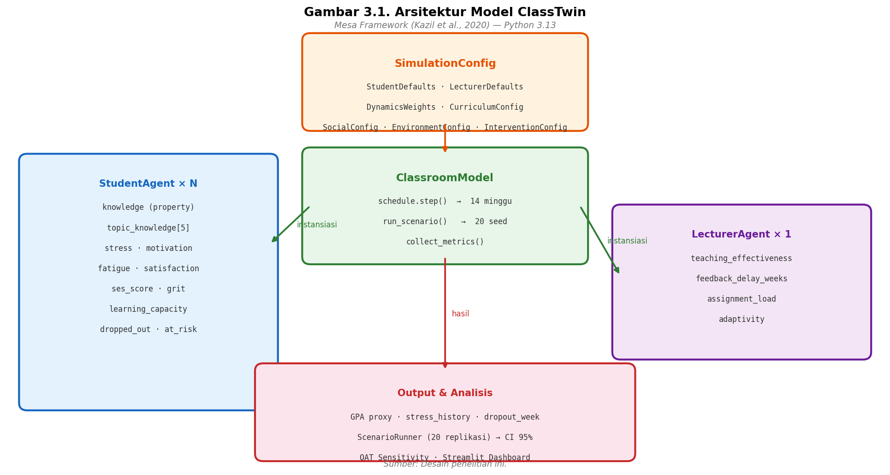
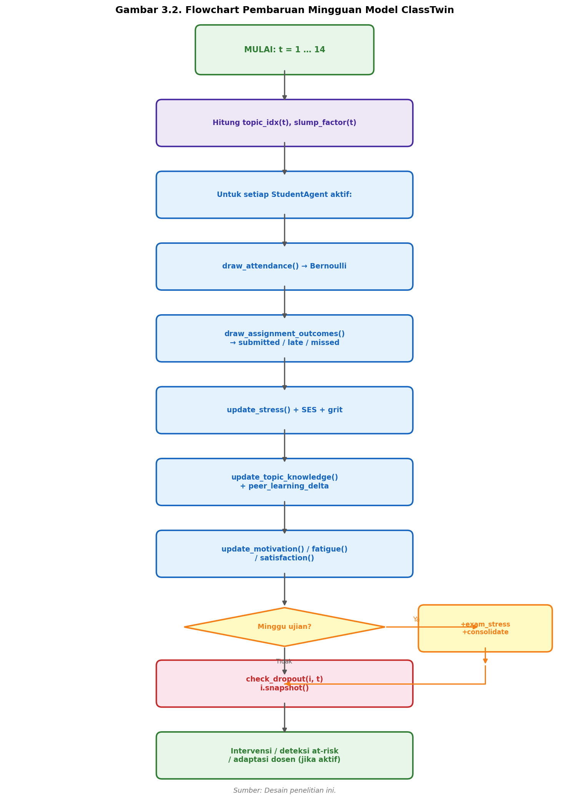
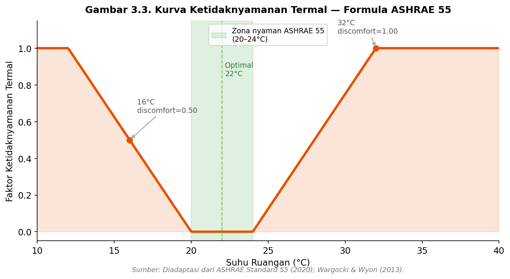
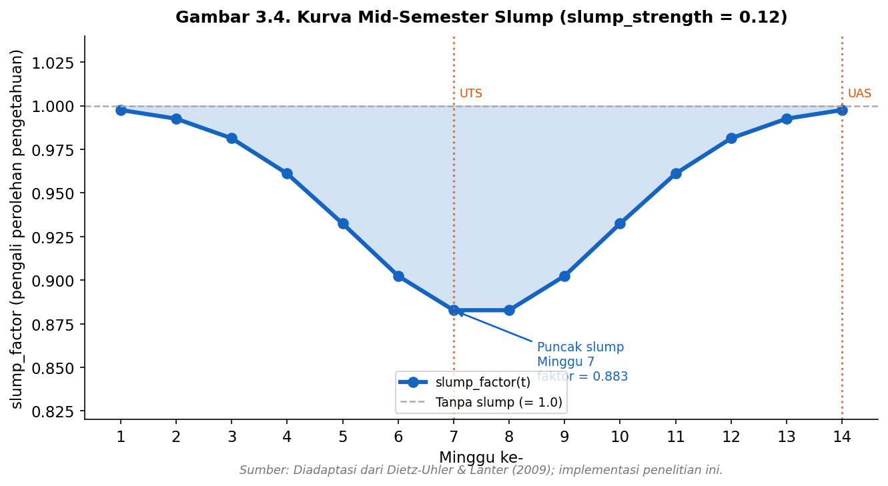
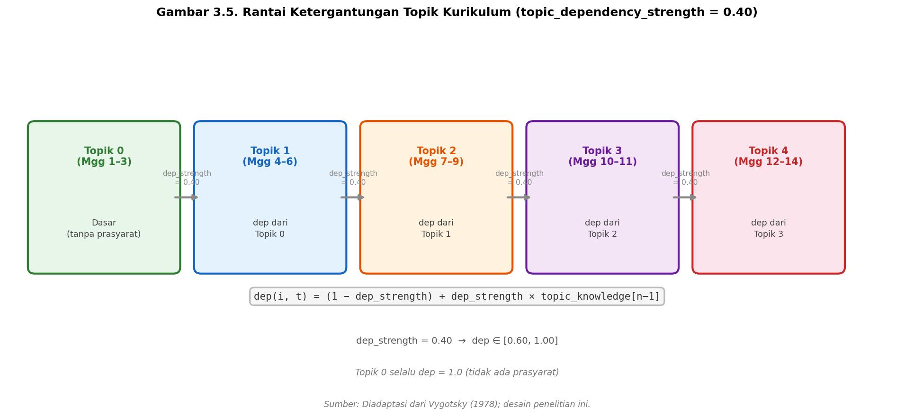

## BAB III: METODOLOGI PENELITIAN

### 3.1 Metode Penelitian

Penelitian ini tergolong dalam **penelitian eksperimental berbasis simulasi** (*simulation-based experimental research*) dengan pendekatan kuantitatif. Berbeda dengan penelitian eksperimental konvensional yang mengumpulkan data dari subjek manusia secara langsung, penelitian ini menggunakan model komputasional sebagai instrumen eksperimen. Paradigma ini dikenal sebagai *in silico experimentation* dan umum digunakan dalam ilmu komputer, rekayasa sistem, dan penelitian kebijakan berbasis model (Bonabeau, 2002; Gilbert, 2008).

Dari sudut pandang desain penelitian, pendekatan yang digunakan mengikuti kerangka *Design Science Research* (DSR): sebuah artefak komputasional (model simulasi ClassTwin) dirancang, diimplementasikan, dan dievaluasi untuk menjawab rumusan masalah yang telah ditetapkan. Artefak ini bukan tujuan akhir, melainkan instrumen penelitian yang memungkinkan eksperimentasi kebijakan yang tidak mungkin atau tidak etis dilakukan secara langsung pada populasi mahasiswa nyata.

Pendekatan kuantitatif digunakan karena seluruh variabel yang dianalisis (IPK rata-rata, tingkat kegagalan, tingkat stres, tingkat kehadiran) direpresentasikan sebagai nilai numerik yang dapat dibandingkan secara statistik menggunakan metrik agregat dan interval kepercayaan.

Model diimplementasikan menggunakan *agent loop* kustom berbasis Python dengan NumPy untuk pembangkitan bilangan acak dan Pydantic untuk konfigurasi. Pemilihan pendekatan kustom atas alternatif seperti Mesa (Kazil et al., 2020), NetLogo, atau Repast didasarkan pada: (1) kontrol penuh atas alur simulasi tanpa abstraksi tambahan yang tidak diperlukan, (2) reprodusibilitas penuh melalui `requirements.txt` dan konfigurasi JSON terserialisasi, (3) integrasi langsung dengan ekosistem Python (pandas, matplotlib, Streamlit), dan (4) ringan tanpa dependensi kerangka kerja ABM eksternal. Arsitektur ini memisahkan aturan pembaruan (*dynamics*) sebagai fungsi murni tanpa *side effect*, memungkinkan pengujian unit secara independen.

---

### 3.2 Objek Penelitian

Objek penelitian dalam studi ini adalah **ekosistem kelas perkuliahan universitas** yang direpresentasikan sebagai model simulasi berbasis agen. Model ini mensimulasikan satu kelas dalam satu semester (14 minggu) dengan dua jenis entitas: mahasiswa (*StudentAgent*) dan dosen (*LecturerAgent*).

Ekosistem kelas yang dimodelkan mencakup variabel-variabel berikut:
- **Variabel kebijakan** (dapat dikonfigurasi): ukuran kelas, keterlambatan umpan balik, beban tugas, mode perkuliahan, suhu ruangan, dan program intervensi tutoring.
- **Variabel output** (diukur): IPK proksi rata-rata, tingkat kegagalan, tingkat putus studi, distribusi stres, dan kesenjangan IPK antar-kuartil SES.

Model tidak menggunakan data dari kelas atau institusi nyata tertentu. Parameter model bersifat ilustratif dan dipilih agar menghasilkan pola kualitatif yang konsisten dengan literatur psikologi pendidikan, bukan dikalibrasi dari data empiris spesifik.

---

### 3.3 Waktu dan Tempat Penelitian

Penelitian ini dilaksanakan dari **Oktober 2025 hingga Juni 2026** di Program Studi Sistem Informasi, Fakultas Teknik, Universitas Widyatama, Bandung. Seluruh kegiatan pengembangan model, eksperimen simulasi, dan analisis data dilakukan secara komputasional menggunakan perangkat keras pribadi peneliti tanpa memerlukan fasilitas laboratorium khusus.

Tabel 3.1 merangkum tahapan dan jadwal pelaksanaan penelitian.

**Tabel 3.1: Jadwal Pelaksanaan Penelitian**

| Tahap | Kegiatan | Bulan |
|---|---|---|
| 1 | Studi literatur & perumusan masalah | Oktober–November 2025 |
| 2 | Perancangan arsitektur model & konfigurasi agen | November–Desember 2025 |
| 3 | Implementasi model (Mesa + Pydantic) | Desember 2025–Januari 2026 |
| 4 | Desain & eksekusi skenario eksperimen (15 skenario) | Februari–Maret 2026 |
| 5 | Analisis sensitivitas OAT & uji validasi | Maret–April 2026 |
| 6 | Pengembangan dashboard Streamlit | April 2026 |
| 7 | Penulisan laporan & revisi | April–Juni 2026 |

---

### 3.4 Teknik Pengumpulan Data

Data yang dianalisis dalam penelitian ini bersifat **sintetis**: dihasilkan seluruhnya oleh model simulasi berdasarkan aturan-aturan yang didefinisikan secara eksplisit. Tidak ada pengumpulan data primer dari responden manusia. Pendekatan ini umum digunakan dalam penelitian kebijakan berbasis ABM (*in silico experimentation*) sebelum kalibrasi dengan data empiris tersedia (Gilbert, 2008).

Pengumpulan data dilakukan melalui dua metode:

1. **Studi literatur**: Nilai-nilai parameter dan rentang yang masuk akal ditentukan berdasarkan literatur empiris (Hattie, 2008; Shute, 2008; Sirin, 2005; ASHRAE, 2017). Daftar referensi parameter selengkapnya tersedia di Tabel 3.4 pada Bagian 3.5.
2. **Eksperimen simulasi**: Setiap skenario dijalankan sebanyak 20 kali dengan *seed* yang berbeda menggunakan `numpy.random.default_rng(seed)` untuk memperoleh estimasi yang *robust* terhadap variasi stokastik. Interval kepercayaan 95% dihitung dari 20 replikasi per skenario.

Analisis dilakukan melalui tiga pendekatan: (1) perbandingan metrik agregat antar-skenario terhadap baseline, (2) analisis sensitivitas *one-at-a-time* (OAT), dan (3) uji robustisitas multi-*seed*.

---

### 3.5 Diagram Alur Penelitian

Gambar 3.1 menunjukkan diagram alur keseluruhan proses penelitian, dari identifikasi masalah hingga penarikan kesimpulan.


*Gambar 3.1. Diagram alur penelitian ClassTwin: dari studi literatur dan perancangan model, melalui implementasi dan eksperimen skenario, hingga validasi dan analisis hasil.*

Tahapan penelitian terdiri dari empat fase utama:

1. **Fase Perancangan**: Studi literatur psikologi pendidikan → identifikasi variabel kunci → perancangan arsitektur agen dan aturan pembaruan mingguan.
2. **Fase Implementasi**: Pengkodean model menggunakan Mesa dan Python → konfigurasi 15 skenario eksperimen → pengembangan dashboard Streamlit.
3. **Fase Eksperimen**: Eksekusi 15 skenario × 20 replikasi → analisis sensitivitas OAT → uji validasi (face validity, determinisme, clamp test, konvergensi).
4. **Fase Analisis**: Perbandingan metrik antar-skenario → penarikan kesimpulan terhadap 5 rumusan masalah → dokumentasi keterbatasan dan saran penelitian lanjutan.

---

### 3.6 Arsitektur Model



*Gambar 3.1. Arsitektur model ClassTwin: SimulationConfig mendefinisikan seluruh parameter secara deklaratif, ClassroomModel mengorkestrasikan eksperimen, dan dua jenis agen (StudentAgent × N dan LecturerAgent × 1) menghasilkan output yang dianalisis oleh ScenarioRunner dan dashboard Streamlit.*

Model *Classroom Ecosystem Digital Twin* (ClassTwin) adalah simulasi berbasis agen berjenis diskret-waktu (*discrete-time*) yang diimplementasikan menggunakan *agent loop* kustom berbasis Python dengan NumPy. Setiap langkah waktu merepresentasikan satu minggu perkuliahan, dan simulasi dijalankan selama 14 minggu (satu semester penuh).

Model terdiri dari dua jenis agen:

1. **StudentAgent** (N buah, dikonfigurasi): Merepresentasikan seorang mahasiswa dengan atribut dan status yang berubah setiap minggu.
2. **LecturerAgent** (1 buah): Merepresentasikan dosen kelas dengan atribut pengajaran yang tetap selama satu simulasi.

Seluruh parameter model dikonfigurasi melalui objek `SimulationConfig` yang berbasis Pydantic, memungkinkan semua skenario untuk didefinisikan secara deklaratif dan disimpan sebagai berkas JSON untuk reprodusibilitas. Tabel 3.1 merangkum variabel status utama setiap agen.

**Tabel 3.1: Variabel Status Agen**

| Agen | Variabel | Rentang | Deskripsi |
|---|---|---|---|
| StudentAgent | `knowledge` | [0, 1] | Penguasaan materi kumulatif (rata-rata `topic_knowledge`) |
| StudentAgent | `topic_knowledge` | [0, 1]^n | Vektor penguasaan per topik kurikulum |
| StudentAgent | `stress` | [0, 1] | Tingkat stres akademik |
| StudentAgent | `motivation` | [0, 1] | Motivasi belajar |
| StudentAgent | `fatigue` | [0, 1] | Kelelahan kognitif terakumulasi |
| StudentAgent | `satisfaction` | [0, 1] | Kepuasan akademik proksi |
| StudentAgent | `attendance_streak` | ℤ≥0 | Minggu berturut-turut hadir |
| StudentAgent | `assignment_completion` | [0, 1] | Rasio tugas yang diselesaikan |
| StudentAgent | `ses_score` | [0, 1] | Skor status sosial ekonomi |
| StudentAgent | `learning_capacity` | [0.6, 1.4] | Pengali kapasitas belajar individual |
| StudentAgent | `grit` | [0, 1] | Kegigihan menghadapi rintangan |
| LecturerAgent | `teaching_effectiveness` | [0.6, 1.4] | Kejelasan penyampaian materi |
| LecturerAgent | `feedback_delay_weeks` | {0,1,2,3,4} | Keterlambatan pengembalian nilai |
| LecturerAgent | `assignment_load` | {0,1,2,3} | Jumlah tugas per minggu |
| LecturerAgent | `adaptivity` | [0, 1] | Derajat adaptasi dosen terhadap performa kelas |

---

### 3.8 Inisialisasi Agen

#### 3.8.1 Inisialisasi StudentAgent

Pada awal simulasi (minggu 0), setiap `StudentAgent` diinisialisasi dengan nilai acak yang diambil dari distribusi yang dapat dikonfigurasi. Pemilihan distribusi untuk masing-masing atribut didasarkan pada pertimbangan teoritis yang berbeda:

**Tabel 3.2: Distribusi Inisialisasi Atribut StudentAgent**

| Atribut | Distribusi | Parameter Default | Dasar Pemilihan Distribusi |
|---|---|---|---|
| `learning_capacity` | Uniform(a, b) | a=0.60, b=1.40 | Tidak ada asumsi pemusatan; heterogenitas kemampuan belajar merata |
| `knowledge` | TruncNormal(μ, σ, [0,1]) | μ=0.35, σ=0.10 | Mahasiswa cenderung berkelompok di sekitar pengetahuan awal sedang |
| `motivation` | TruncNormal(μ, σ, [0,1]) | μ=0.65, σ=0.10 | Mayoritas mahasiswa memiliki motivasi cukup tinggi di awal semester (Pintrich, 2003) |
| `stress` | TruncNormal(μ, σ, [0,1]) | μ=0.25, σ=0.08 | Stres rendah di minggu pertama sebelum akumulasi beban tugas |
| `ses_score` | TruncNormal(μ, σ, [0,1]) | μ=0.50, σ=0.20 | Keberagaman SES sedang; std dapat dikonfigurasi per skenario |
| `grit` | TruncNormal(μ, σ, [0,1]) | μ=0.60, σ=0.15 | Mengacu pada distribusi empiris skor *Grit Scale* (Duckworth et al., 2007) |

Alasan pemisahan distribusi: `learning_capacity` menggunakan Uniform karena penelitian ini tidak membuat asumsi bahwa kemampuan belajar mahasiswa memuncak di nilai tertentu — heterogenitas diasumsikan merata di seluruh spektrum kemampuan. Atribut psikologis (motivasi, stres, grit) menggunakan TruncatedNormal karena distribusi empiris konstruk psikologis umumnya berbentuk kurva lonceng, tidak datar (Duckworth et al., 2007; Pintrich, 2003).

Semua angka acak dibangkitkan menggunakan `numpy.random.default_rng(seed)` dengan *seed* yang ditentukan oleh pengguna. Seluruh nilai diklem ke rentang valid setelah setiap pembaruan menggunakan fungsi:

```python
def _clamp(value: float, lo: float = 0.0, hi: float = 1.0) -> float:
    return max(lo, min(hi, value))
```

#### 3.8.2 Inisialisasi LecturerAgent

`LecturerAgent` diinisialisasi dengan parameter tetap (deterministik, tidak stokastik) yang merepresentasikan karakteristik pengajaran dosen selama satu semester. Atribut dosen dapat dikonfigurasi melalui `LecturerDefaults`:

**Tabel 3.3: Atribut Inisialisasi LecturerAgent**

| Atribut | Nilai Default | Rentang | Deskripsi |
|---|---|---|---|
| `teaching_effectiveness` | 1.0 | [0.6, 1.4] | Pengali efektivitas penyampaian materi |
| `feedback_delay_weeks` | 1 | {0,1,2,3,4} | Minggu sebelum nilai dikembalikan |
| `assignment_load` | 2 | {0,1,2,3} | Jumlah tugas yang diberikan per minggu |
| `strictness` | 0.5 | [0, 1] | Penalti nilai untuk keterlambatan pengumpulan |
| `adaptivity` | 0.0 | [0, 1] | Seberapa kuat dosen menyesuaikan gaya mengajar saat kelas tertinggal |
| `adaptation_threshold` | 0.40 | [0, 1] | Ambang rata-rata pengetahuan kelas yang memicu adaptasi |
| `adaptation_boost` | 0.15 | [0, 1] | Peningkatan maksimal efektivitas per minggu saat adaptasi aktif |

Dosen **adaptif** (`adaptivity > 0`) meningkatkan `current_effectiveness` secara bertahap ketika rata-rata pengetahuan kelas jatuh di bawah `adaptation_threshold`, mensimulasikan perilaku dosen yang responsif terhadap sinyal performa kelas (skenario `adaptive_lecturer`).

#### 3.8.3 Struktur Topik Kurikulum

Kurikulum terdiri dari `n_topics = 5` topik yang didistribusikan secara merata sepanjang 14 minggu. Topik yang diajarkan pada minggu *t* ditentukan oleh fungsi:

```
topic_idx(t) = round( ((t − 1) / (n_weeks − 1)) × (n_topics − 1) )
```

Sehingga:
- Minggu 1–3: Topik 0
- Minggu 4–6: Topik 1
- Minggu 7–9: Topik 2
- Minggu 10–11: Topik 3
- Minggu 12–14: Topik 4

Setiap mahasiswa memiliki vektor pengetahuan `topic_knowledge[0..4]`, di mana `knowledge` (properti skalar) = `mean(topic_knowledge)`.

---

### 3.9 Aturan Pembaruan Mingguan

Setiap minggu, model menjalankan urutan pembaruan berikut untuk setiap mahasiswa yang masih aktif (belum putus studi). Gambar 3.2 menunjukkan alur keseluruhan secara visual, dan pseudocode di bawah merinci logika setiap langkah.



*Gambar 3.2. Flowchart pembaruan mingguan model ClassTwin. Setiap minggu, seluruh StudentAgent aktif memperbarui kehadiran, stres, pengetahuan, motivasi, kelelahan, dan kepuasan secara berurutan. Cabang ujian menambahkan lonjakan stres dan konsolidasi pengetahuan. Intervensi dan deteksi at-risk berjalan di luar loop agen.*

Algoritma keseluruhan ditunjukkan dalam pseudocode berikut:

```
for each week t in [1, 14]:
    topic_idx ← get_current_topic(t)
    slump_factor ← mid_semester_slump_factor(t)

    for each student i (active):
        received_feedback ← did_receive_feedback(t, feedback_delay)
        attended ← draw_attendance(i, config)          # Bernoulli draw
        (submitted, late, missed) ← draw_assignment_outcomes(i, config)

        stress_new ← update_stress(i, attended, received_feedback, config)
        stress_new ← stress_new
                     − ses_stress_adjustment(i.ses_score)
                     − grit_recovery(i.grit, stress_new)

        topic_knowledge_new ← update_topic_knowledge(i, topic_idx, attended,
                                                      teach_eff, slump_factor, config)
        if enable_peer_learning:
            topic_knowledge_new += compute_peer_learning_delta(i, group_members)

        if is_exam_week(t):
            stress_new ← clamp(stress_new + exam_stress_delta)
            topic_knowledge_new ← consolidate_exam_knowledge(i, config)

        motivation_new ← update_motivation(i, received_feedback, config)
        fatigue_new    ← update_fatigue(i, attended, config)
        satisfaction_new ← update_satisfaction(i, attended, received_feedback, config)

        apply all new values to student i
        check_dropout(i, t, config)
        i.snapshot()  # record week to history

    if intervention.enabled and t in [start_week, end_week]:
        apply_intervention(bottom_quartile_students)

    if t == at_risk_detection_week:
        flag_at_risk_students()

    if lecturer.adaptivity > 0 and mean_knowledge < adaptation_threshold:
        lecturer.current_effectiveness += adaptation_boost × adaptivity
```

#### 3.9.1 Kehadiran

Probabilitas kehadiran mahasiswa *i* pada minggu *t* dihitung sebagai:

```
p_attend(i,t) = attendance_prob_base(i)
              − w_stress_attend × stress(i,t)
              + w_mot_attend × motivation(i,t)
              + schedule_mod × 0.5
              + mode_mods["attendance_bonus"]
              − 0.15 × discomfort(room_temp)
```

Dengan nilai parameter default: `w_stress_attend = 0.30`, `w_mot_attend = 0.20`. Nilai diklem ke [0.05, 0.99] untuk menghindari probabilitas nol atau satu mutlak. Kehadiran aktual ditentukan melalui undian Bernoulli: `attended = (random() < p_attend)`.

Efek jadwal: kelas pagi (`morning`) mengurangi probabilitas kehadiran sebesar 0.025 (= 0.05 × 0.5), kelas malam (`evening`) sebesar 0.05. Pengaruh suhu ruangan: setiap kenaikan ketidaknyamanan termal sebesar 1 unit mengurangi probabilitas kehadiran 0.15 (lihat Bagian 3.4.7).

#### 3.9.2 Penyelesaian Tugas

Untuk setiap tugas yang diberikan pada minggu *t*, probabilitas penyelesaian tepat waktu dihitung sebagai:

```
p_complete(i,t) = 0.85
                 − w_stress_compl × stress(i,t)
                 + w_mot_compl × motivation(i,t)
```

Dengan `w_stress_compl = 0.40` dan `w_mot_compl = 0.30`. Nilai diklem ke [0.05, 0.99].

Untuk setiap tugas yang *tidak* diselesaikan tepat waktu, terdapat probabilitas pengumpulan terlambat:

```
p_late | not_ontime = clamp(late_work_prob(i) × (1 − stress(i,t) × 0.5))
```

Sehingga untuk setiap tugas, tiga kemungkinan hasil:
- **Tepat waktu** dengan probabilitas `p_complete`
- **Terlambat** dengan probabilitas `(1 − p_complete) × p_late`
- **Tidak dikumpulkan** dengan probabilitas sisa

Penyelesaian tugas yang terlambat mendapat penalti nilai berdasarkan parameter `strictness` dosen, yang digunakan dalam perhitungan `effective_completion` pada akhir semester (Bagian 3.5).

#### 3.9.3 Dinamika Stres

Stres mahasiswa diperbarui melalui model aditif dalam dua tahap.

**Tahap 1 — Pembaruan primer:**

```
Δstress(i,t) = w_load × assignment_load
             + w_pending × pending_feedback_weeks(i,t)
             + w_absence × (1 − attended(i,t))
             + external_pressure × 0.02
             − w_feedback_relief × received_feedback(i,t)
             − w_rest
```

Parameter stres (nilai default):

| Parameter | Simbol | Nilai | Deskripsi |
|---|---|---|---|
| `w_stress_load` | w_load | 0.04 | Stres per tugas per minggu |
| `w_stress_pending_feedback` | w_pending | 0.03 | Stres per minggu umpan balik tertunda |
| `w_stress_absence` | w_absence | 0.05 | Stres saat tidak hadir |
| `w_stress_feedback_relief` | w_relief | 0.08 | Penurunan stres saat umpan balik tiba |
| `w_stress_rest` | w_rest | 0.03 | Pemulihan stres mingguan baseline |

**Tahap 2 — Koreksi SES dan grit:**

```
stress_final(i,t) = stress_after_step1
                   − w_ses × ses_score(i)
                   − w_grit × grit(i) × stress_after_step1
```

Dengan `w_ses = 0.10` dan `w_grit = 0.05`. Interpretasi: mahasiswa SES tinggi memiliki sumber daya (finansial, dukungan keluarga) yang meredam stres kronis (Sirin, 2005). Mahasiswa dengan grit tinggi pulih lebih cepat saat stres meninggi — efek moderasi ini konsisten dengan Duckworth et al. (2007) yang menemukan grit berkorelasi dengan regulasi diri di bawah tekanan.

Mahasiswa dengan stres tinggi secara berturut-turut (melebihi ambang `dropout_stress_threshold = 0.92` selama `dropout_consecutive_weeks = 3` minggu) **dan** memiliki pengetahuan di bawah `dropout_knowledge_threshold = 0.25` ditandai sebagai *dropped out* (lihat Bagian 3.4.8).

#### 3.9.4 Dinamika Pengetahuan

Pengetahuan direpresentasikan sebagai vektor per topik `topic_knowledge[0..n_topics-1]`. Setiap minggu, perubahan pengetahuan untuk topik yang sedang diajarkan dihitung sebagai:

```
dep(i,t)  = (1 − dep_strength) + dep_strength × topic_knowledge[topic_idx − 1]
diff(t)   = 1 − 0.3 × (topic_idx / (n_topics − 1))          [kurva linear]
fat(i,t)  = 1 − w_fatigue_penalty × fatigue(i,t)
g(i,t)    = motivation(i,t) × (1 − stress(i,t))

Δk(i,t)   = base_rate × attended(i,t) × teach_eff_effective
           × learning_capacity(i) × g(i,t)
           × dep(i,t) × diff(t) × fat(i,t) × slump(t)
```

Semua topik mengalami peluruhan (*forgetting*) mingguan:

```
topic_knowledge_new[j] = clamp(topic_knowledge[j] − knowledge_decay)    ∀ j
topic_knowledge_new[topic_idx] += Δk(i,t)
```

Penjelasan komponen:

| Komponen | Nilai Default | Landasan Teori |
|---|---|---|
| `base_learning_rate` | 0.42 | Dikalibrasi agar IPK baseline ≈ 3.0 |
| `dep_strength = 0.40` | — | Ketergantungan antarmateri: ZPD Vygotsky (1978) |
| `diff(t)` kurva linear | 1.0 → 0.7 | Topik akhir lebih sulit (Bloom's taxonomy) |
| `knowledge_decay = 0.003` | — | Forgetting curve: Ebbinghaus (1885) |
| `w_fatigue_penalty = 0.20` | — | Kelelahan kognitif mengurangi kapasitas belajar (Kahneman, 1973) |

**Topik dependency:** Untuk topik 0 (tidak ada prasyarat), `dep = 1.0`. Untuk topik *n > 0*, `dep` skala dari `(1 − dep_strength) = 0.60` (tidak menguasai prasyarat sama sekali) hingga `1.0` (menguasai prasyarat penuh). Ini merepresentasikan bahwa mahasiswa yang tidak menguasai materi sebelumnya akan lebih kesulitan menyerap materi berikutnya — konsisten dengan struktur kurikulum STEM (Vygotsky, 1978).

#### 3.9.5 Siklus Umpan Balik

Pengembalian nilai tugas terjadi setelah penundaan `feedback_delay_weeks` minggu. Ketersediaan umpan balik pada minggu *t*:

```
received_feedback(t) = (t ≥ feedback_delay_weeks)
```

Ketika umpan balik diterima:
- Stres turun sebesar `w_stress_feedback_relief = 0.08`
- Motivasi naik sebesar `motivation_feedback_boost = 0.05`

Selama periode penundaan, setiap minggu tanpa umpan balik menambah `w_pending = 0.03` ke stres mahasiswa melalui `pending_feedback_weeks`. Akumulasi ini memodelkan ketidakpastian nilai yang dirasakan mahasiswa (Shute, 2008: umpan balik tertunda meningkatkan kecemasan dan menghambat regulasi belajar mandiri).

Kualitas umpan balik juga terdegradasi seiring ukuran kelas:

```
feedback_quality(N) = clamp(30 / N, lo=0.5, hi=1.0)
```

Sehingga kelas 30 mahasiswa mendapat kualitas umpan balik 1.0, kelas 60 mahasiswa mendapat 0.5. Ini memodelkan keterbatasan waktu dosen dalam memberikan umpan balik individual yang bermakna pada kelas besar (Hattie, 2008).

#### 3.9.6 Dinamika Motivasi

Motivasi diperbarui setiap minggu melalui:

```
Δmotivation(i,t) = motivation_feedback_boost × received_feedback(i,t)
                  − motivation_decay
                  − mode_mods["motivation_decay_extra"]
                  − 0.015 × discomfort(room_temp)
                  + schedule_mod × 0.005
```

Dengan `motivation_feedback_boost = 0.05` dan `motivation_decay = 0.01`. Motivasi juga dipengaruhi oleh *mid-semester slump* (Bagian 3.4.9) yang memodulasi seluruh proses belajar secara tidak langsung melalui faktor pengali pada perolehan pengetahuan.

Mode kelas online menambah peluruhan motivasi ekstra sebesar 0.01 per minggu, mencerminkan temuan Means et al. (2009) bahwa keterlibatan mahasiswa dalam kelas daring cenderung lebih rendah tanpa interaksi tatap muka.

#### 3.9.7 Ketidaknyamanan Termal

Fungsi ketidaknyamanan termal dihitung sebagai berikut, dengan kurva visualisasinya ditunjukkan pada Gambar 3.3.

```
discomfort(temp) = clamp( (|temp − 22| − 2) / 8.0, lo=0, hi=1 )
```

Fungsi ini bernilai 0 pada rentang 20–24°C (zona nyaman per standar ASHRAE 55) dan meningkat secara linear di luar rentang tersebut:

| Suhu (°C) | Discomfort | Dampak |
|---|---|---|
| 22 | 0.00 | Optimal |
| 26 | 0.25 | Ringan: −0.04 kehadiran, −0.004 motivasi |
| 30 | 0.75 | Sedang: −0.11 kehadiran, −0.011 motivasi |
| 32 | 1.00 | Maksimal: −0.15 kehadiran, −0.015 motivasi |
| 16 | 0.50 | Dingin: −0.08 kehadiran, −0.008 motivasi |

Ketidaknyamanan termal memengaruhi dua variabel: (1) probabilitas kehadiran berkurang `0.15 × discomfort`, dan (2) motivasi berkurang `0.015 × discomfort` per minggu. Ini konsisten dengan meta-analisis Wargocki & Wyon (2013) yang menemukan suhu di luar zona nyaman mengurangi performa kognitif hingga 10%.



*Gambar 3.3. Kurva ketidaknyamanan termal sebagai fungsi suhu ruangan. Zona nyaman (20–24°C) menghasilkan discomfort = 0. Di luar zona ini, discomfort meningkat secara linear hingga maksimum 1.0 pada suhu ≤14°C atau ≥30°C, sesuai standar ASHRAE 55 (2020).*

#### 3.9.8 Deteksi Putus Studi (*Dropout*)

Mekanisme dropout menggunakan dua kondisi yang harus terpenuhi **bersamaan**:

```
if stress(i,t) ≥ dropout_stress_threshold:
    consecutive_high_stress_weeks(i) += 1
else:
    consecutive_high_stress_weeks(i) = 0

if consecutive_high_stress_weeks(i) ≥ dropout_consecutive_weeks
   AND knowledge(i) < dropout_knowledge_threshold:
    student i → dropped_out = True
    dropout_week = t
```

Parameter default: `dropout_stress_threshold = 0.92`, `dropout_consecutive_weeks = 3`, `dropout_knowledge_threshold = 0.25`. Keharusan kedua kondisi (stres kronis **dan** pengetahuan rendah) mencegah dropout diaktifkan oleh stres sementara pada mahasiswa yang sebenarnya menguasai materi — konsisten dengan model Tinto (1987) bahwa dropout adalah fungsi dari integrasi akademik dan sosial, bukan sekadar stres sesaat.

Mahasiswa yang *dropped out* dibekukan statusnya: nilai stres, pengetahuan, dan atribut lain tidak berubah, namun rekaman mingguan tetap ditambahkan ke riwayat (untuk keperluan analisis trajektori).

#### 3.9.9 Efek *Mid-Semester Slump*

Fenomena penurunan motivasi di pertengahan semester dimodelkan menggunakan fungsi Gaussian terpusat pada titik tengah semester:

```
midpoint = (n_weeks + 1) / 2
sigma    = n_weeks / 6
peak     = exp(−0.5 × ((t − midpoint) / sigma)²)
slump_factor(t) = 1 − slump_strength × peak
```

Dengan `slump_strength = 0.12` (default), fungsi ini menghasilkan faktor pengali antara 0.88 (di puncak slump, sekitar minggu 7–8) hingga 1.0 (di awal dan akhir semester). Faktor ini mengalikan perolehan pengetahuan mingguan seluruh mahasiswa, mensimulasikan penurunan produktivitas kolektif di pertengahan semester yang umum dilaporkan dalam literatur pendidikan tinggi (Dietz-Uhler & Lanter, 2009). Gambar 3.4 memvisualisasikan profil faktor ini sepanjang 14 minggu.



*Gambar 3.4. Profil faktor mid-semester slump selama 14 minggu. Penurunan terjadi secara Gaussian terpusat pada minggu 7–8 (pertengahan semester), dengan nilai minimum ~0.88 pada puncaknya. Garis vertikal oranye menunjukkan minggu ujian (UTS minggu 7, UAS minggu 14).*

#### 3.9.10 Dinamika Kelelahan (*Fatigue*)

Kelelahan kognitif terakumulasi dari aktivitas akademik dan berkurang melalui istirahat:

```
Δfatigue(i,t) = −w_fatigue_rest
              + (w_fatigue_gain + external_pressure × 0.02)
                × mode_mods["fatigue_gain_mult"]
                × attended(i,t)
```

Dengan `w_fatigue_rest = 0.06` dan `w_fatigue_gain = 0.04`. Mahasiswa yang tidak hadir tidak mengakumulasi kelelahan dari kegiatan kelas (meskipun tetap mendapat stres dari ketidakhadiran).

Mode kelas memengaruhi akumulasi kelelahan: kelas online memiliki `fatigue_gain_mult = 0.50` (tidak ada kelelahan perjalanan), kelas hibrida `0.75`, dan tatap muka `1.0`. Kelelahan memengaruhi perolehan pengetahuan melalui `fat_penalty = 1 − w_fatigue_penalty × fatigue` dengan `w_fatigue_penalty = 0.20`.

#### 3.9.11 Kepuasan Akademik

Kepuasan akademik diperbarui sebagai proksi keterlibatan mahasiswa (*engagement*):

```
Δsatisfaction(i,t) = 0.03 × received_feedback(i,t)
                   + 0.02 × attended(i,t)
                   − 0.04 × stress(i,t)
                   + 0.01 × motivation(i,t)
                   − 0.02
```

Nilai baseline decay −0.02 merepresentasikan tekanan nilai dan ekspektasi akademik yang secara inheren mengurangi kepuasan mahasiswa dari waktu ke waktu jika tidak ada reinforcement positif.

#### 3.9.12 Pembelajaran Teman Sebaya (*Peer Learning*)

Jika `enable_peer_learning = True`, mahasiswa dibagi ke dalam kelompok belajar (*study groups*) berukuran `study_group_size = 4`. Strategi pembentukan kelompok default adalah `mixed` (heterogen): mahasiswa diurutkan berdasarkan pengetahuan awal, kemudian didistribusikan ke kelompok secara bergantian, memastikan setiap kelompok memiliki campuran kemampuan.

Transfer pengetahuan dari anggota terkuat ke mahasiswa *i* untuk setiap topik:

```
for each topic j:
    best_k[j] = max(member.topic_knowledge[j] for member in group, member ≠ i)
    gap[j]    = max(0, best_k[j] − topic_knowledge[i][j])
    Δk_peer[j] = peer_learning_rate × gap[j]
```

Dengan `peer_learning_rate = 0.025`. Transfer hanya terjadi ketika *sumber* mengetahui lebih banyak dari *penerima* (gap positif), konsisten dengan konsep ZPD Vygotsky (1978): pembelajaran optimal terjadi ketika pelajar berinteraksi dengan seseorang yang sedikit lebih maju. Mode kelas memengaruhi efektivitas peer learning melalui `mode_mods["peer_learning_mult"]`: tatap muka (1.0), hibrida (0.65), daring (0.35).

Struktur ketergantungan antarmateri yang menjadi dasar peer learning divisualisasikan pada Gambar 3.5.



*Gambar 3.5. Rantai ketergantungan topik kurikulum. Setiap topik bergantung pada penguasaan topik sebelumnya dengan kekuatan dep_strength = 0.40. Topik 0 tidak memiliki prasyarat (dep = 1.0 selalu). Formula dep(i,t) menghasilkan nilai antara 0.60 (prasyarat tidak dikuasai) hingga 1.00 (prasyarat dikuasai penuh).*

#### 3.9.13 Intervensi Tutoring

Jika intervensi diaktifkan dan waktu berada dalam jendela `[start_week, end_week]`, mahasiswa yang berada di kuartil terbawah berdasarkan pengetahuan pada minggu deteksi risiko (default: minggu 5) menerima perubahan motivasi dan stres setiap minggu:

```
motivation_new(i) = clamp(motivation(i) + intervention_motivation_boost)
stress_new(i)     = clamp(stress(i) − intervention_stress_reduction)
```

Dengan nilai default `motivation_boost = 0.10` dan `stress_reduction = 0.10`. Mahasiswa yang ditarget ditandai dengan `at_risk = True` pada minggu deteksi dan `is_intervention_target = True` selama periode intervensi.

---

### 3.10 Formula IPK Proksi

Pada akhir semester (minggu 14), IPK proksi setiap mahasiswa dihitung sebagai:

```
on_time_rate  = Σ assignments_submitted / total_expected
late_rate     = Σ assignments_late / total_expected
effective_completion = clamp(on_time_rate + (1 − strictness) × late_rate)

raw_score = knowledge_final × w_knowledge + effective_completion × w_completion
gpa_proxy = clamp(raw_score × 4.0, lo=0, hi=4)
```

Dengan `w_knowledge = 0.70` dan `w_completion = 0.30`. IPK proksi diklasifikasikan sebagai *gagal* (*failure*) jika `gpa_proxy < 2.0`.

Bobot 70/30 antara pengetahuan dan penyelesaian tugas merepresentasikan asumsi umum bahwa nilai akhir seorang mahasiswa lebih didominasi oleh pemahaman materi (ujian akhir, ujian tengah semester) dibandingkan sekadar penyelesaian tugas harian. Sertaan komponen penyelesaian tugas didasarkan pada temuan Credé & Kuncel (2008) bahwa kebiasaan belajar merupakan prediktor signifikan kinerja akademik yang bersifat komplementer terhadap kemampuan kognitif.

Parameter `strictness` dosen memengaruhi sejauh mana pengumpulan terlambat diperhitungkan: `strictness = 1.0` berarti tidak ada kredit untuk keterlambatan, `strictness = 0.0` berarti terlambat dan tepat waktu diperlakukan sama.

**Tabel 3.4: Ringkasan Parameter Bobot DynamicsWeights**

| Parameter | Nilai Default | Satuan | Dasar Literatur |
|---|---|---|---|
| `base_learning_rate` | 0.42 | — | Kalibrasi iteratif; target IPK baseline ≈ 3.0 |
| `knowledge_decay` | 0.003 | per minggu | Ebbinghaus (1885): forgetting curve |
| `topic_dependency_strength` | 0.40 | — | Vygotsky (1978): ZPD, prasyarat materi |
| `w_stress_load` | 0.04 | per tugas | Calibrated; Shute (2008): beban kerja & stres |
| `w_stress_pending_feedback` | 0.03 | per minggu | Shute (2008): ketidakpastian umpan balik |
| `w_stress_absence` | 0.05 | per kejadian | Credé & Kuncel (2008): absensi & kecemasan |
| `w_stress_feedback_relief` | 0.08 | per kejadian | Shute (2008): umpan balik meredakan kecemasan |
| `w_stress_rest` | 0.03 | per minggu | Baseline recovery (heuristik) |
| `w_ses_stress_relief` | 0.10 | per unit SES | Sirin (2005): SES & stres akademik |
| `w_grit_recovery` | 0.05 | per unit grit | Duckworth et al. (2007): grit & resiliensi |
| `motivation_feedback_boost` | 0.05 | per kejadian | Shute (2008): umpan balik & motivasi |
| `motivation_decay` | 0.01 | per minggu | Pintrich (2003): motivasi menurun tanpa reinforcement |
| `stress_attendance_penalty` | 0.30 | per unit stres | Credé & Kuncel (2008) |
| `motivation_attendance_bonus` | 0.20 | per unit motivasi | Pintrich (2003) |
| `stress_completion_penalty` | 0.40 | per unit stres | Credé & Kuncel (2008) |
| `motivation_completion_bonus` | 0.30 | per unit motivasi | Pintrich (2003) |
| `w_fatigue_gain` | 0.04 | per minggu hadir | Kahneman (1973): cognitive load theory |
| `w_fatigue_rest` | 0.06 | per minggu | Kahneman (1973) |
| `w_fatigue_learning_penalty` | 0.20 | per unit fatigue | Kahneman (1973): kelelahan & kapasitas belajar |
| `peer_learning_rate` | 0.025 | per unit gap | Vygotsky (1978): ZPD |
| `dropout_stress_threshold` | 0.92 | — | Tinto (1987): heuristik model dropout |
| `dropout_consecutive_weeks` | 3 | minggu | Tinto (1987) |
| `dropout_knowledge_threshold` | 0.25 | — | Heuristik kalibrasi |
| `mid_semester_slump_strength` | 0.12 | — | Dietz-Uhler & Lanter (2009) |
| `exam_stress_delta` | 0.25 | per ujian | Heuristik; efek ujian pada stres (Zeidner, 1998) |

---

### 3.11 Desain Skenario

Sebelas skenario utama dirancang untuk menjawab kelima pertanyaan penelitian. Tabel 3.5 merangkum konfigurasi setiap skenario.

**Tabel 3.5: Desain Skenario Eksperimen**

| Skenario | Mahasiswa | Delay (mgg) | Beban | SES Std | Intervensi | RQ |
|---|---|---|---|---|---|---|
| Baseline (Standar) | 30 | 1 | 2 | 0.20 | Tidak | Referensi |
| Kelas Kecil | 15 | 1 | 2 | 0.20 | Tidak | RQ1 |
| Kelas Besar | 60 | 1 | 2 | 0.20 | Tidak | RQ1 |
| Umpan Balik Segera | 30 | 0 | 2 | 0.20 | Tidak | RQ2 |
| Umpan Balik Lambat | 30 | 4 | 2 | 0.20 | Tidak | RQ2 |
| Beban Ringan | 30 | 1 | 1 | 0.20 | Tidak | RQ2 |
| Beban Berat | 30 | 1 | 3 | 0.20 | Tidak | RQ2 |
| Skenario Terburuk | 60 | 4 | 3 | 0.20 | Tidak | Kasus ekstrem |
| Program Tutoring | 30 | 1 | 2 | 0.20 | Mgg 7–10 | RQ3 |
| Keberagaman SES Tinggi | 30 | 1 | 2 | 0.40 | Tidak | RQ4 |
| Paket Kebijakan Terbaik | 30 | 0 | 1 | 0.20 | Mgg 5–12 | RQ2+RQ3 |

Selain 11 skenario di atas, empat skenario lingkungan fisik ditambahkan untuk menjawab RQ5: Kelas Panas (32°C), Kelas Dingin (16°C), Perkuliahan Daring Penuh, dan Perkuliahan Hibrida.

Tabel 3.6 memetakan keterkaitan antara setiap skenario dengan pertanyaan penelitian yang dijawab.

**Tabel 3.6: Matriks Skenario × Pertanyaan Penelitian**

| Skenario | RQ1 (Ukuran Kelas) | RQ2 (Umpan Balik & Beban) | RQ3 (Intervensi) | RQ4 (SES) | RQ5 (Lingkungan) |
|---|:---:|:---:|:---:|:---:|:---:|
| Baseline (Standar) | Ref | Ref | Ref | Ref | Ref |
| Kelas Kecil (15) | ✓ | | | | |
| Kelas Besar (60) | ✓ | | | | |
| Umpan Balik Segera (0 mgg) | | ✓ | | | |
| Umpan Balik Lambat (4 mgg) | | ✓ | | | |
| Beban Ringan (1/mgg) | | ✓ | | | |
| Beban Berat (3/mgg) | | ✓ | | | |
| Skenario Terburuk (60+3+4) | ✓ | ✓ | | | |
| Program Tutoring (mgg 7–10) | | | ✓ | | |
| Keberagaman SES Tinggi | | | | ✓ | |
| Paket Kebijakan Terbaik | | ✓ | ✓ | | |
| Kelas Panas (32°C) | | | | | ✓ |
| Kelas Dingin (16°C) | | | | | ✓ |
| Daring Penuh | | | | | ✓ |
| Hibrida | | | | | ✓ |

---

### 3.12 Reprodusibilitas

Setiap simulasi menggunakan `numpy.random.default_rng(seed)` dengan nilai *seed* yang tersimpan bersama konfigurasi. *Seed* yang sama selalu menghasilkan keluaran yang identik (*deterministic reproducibility*). Berkas `config.json` disimpan bersama setiap hasil eksperimen, memungkinkan replikasi penuh.

Struktur reprodusibilitas diimplementasikan sebagai berikut:

```python
rng = numpy.random.default_rng(seed=cfg.seed)
# Semua undian stokastik menggunakan rng ini
attended = rng.random() < p_attend          # kehadiran
outcomes = rng.random(n_assignments)        # penyelesaian tugas
```

Karena seluruh keacakan dihasilkan dari satu *seed* yang terserialisasi, siapapun dapat mereplikasi eksperimen dengan menjalankan:

```bash
python -m src.experiments.runner --seed 42
```

---

### 3.13 Analisis Sensitivitas *One-at-a-Time* (OAT)

Untuk mengidentifikasi parameter kebijakan mana yang paling berpengaruh, dilakukan analisis sensitivitas *one-at-a-time* (OAT). Setiap parameter diubah dari nilai rendah ke nilai tinggi sementara semua parameter lain dipertahankan pada nilai baseline. Selisih metrik (Δ metrik) dihitung relatif terhadap baseline, dan parameter diurutkan berdasarkan |Δ| terbesar.

**Tabel 3.7: Rentang Parameter OAT**

| Parameter | Nilai Rendah | Nilai Baseline | Nilai Tinggi | Satuan |
|---|---|---|---|---|
| Ukuran kelas (`n_students`) | 15 | 30 | 60 | mahasiswa |
| Keterlambatan umpan balik (`feedback_delay_weeks`) | 0 | 1 | 4 | minggu |
| Beban tugas (`assignment_load`) | 1 | 2 | 3 | tugas/mgg |
| Efektivitas pengajaran (`teaching_effectiveness`) | 0.6 | 1.0 | 1.4 | pengali |
| Rerata SES (`ses_score_mean`) | 0.25 | 0.50 | 0.75 | [0,1] |
| Suhu ruangan (`room_temp_celsius`) | 16 | 22 | 32 | °C |
| Pembelajaran teman sebaya | Tidak aktif | Aktif | — | boolean |
| Mode kelas (`class_mode`) | online | in_person | — | kategori |

Setiap konfigurasi dijalankan sebanyak `n_runs = 3` *seed* untuk mengurangi *noise* stokastik, dengan metrik yang dilaporkan adalah IPK rata-rata kelas, tingkat kegagalan (%), dan standar deviasi IPK. Metrik sensitivitas yang digunakan adalah:

```
sensitivity(param) = |metric(high) − metric(low)| / metric(baseline)
```

---

### 3.14 Validasi Model

Model divalidasi melalui empat pendekatan yang saling melengkapi:

**1. Validitas Wajah (*Face Validity*)**

Arah semua efek diperiksa terhadap prediksi literatur. Setiap skenario harus menghasilkan arah efek yang konsisten dengan teori:

| Kondisi | Prediksi Literatur | Referensi |
|---|---|---|
| Kelas besar → IPK lebih rendah | ✓ Hattie (2008): class size effect d=0.20 | Glass & Smith (1979) |
| Umpan balik lambat → stres lebih tinggi | ✓ | Shute (2008) |
| SES rendah → IPK lebih rendah | ✓ | Sirin (2005) |
| Suhu ekstrem → kehadiran lebih rendah | ✓ | ASHRAE 55; Wargocki & Wyon (2013) |
| Peer learning → peningkatan rata-rata kelas | ✓ | Vygotsky (1978) |
| Intervensi tutoring → penurunan kegagalan | ✓ | Tinto (1987) |

**2. Uji Determinisme**

Simulasi dijalankan dua kali dengan *seed* yang sama. Keluaran harus identik secara bit-per-bit. Uji ini memverifikasi tidak ada sumber non-determinisme tersembunyi (misalnya penggunaan `random` global Python atau *threading*).

**3. Uji Klem (*Clamp Test*)**

Semua simulasi dijalankan dengan 100 *seed* acak. Semua variabel status harus tetap berada dalam rentang valid ([0,1] untuk knowledge, stress, motivation, dll.) sepanjang 14 minggu. Keberhasilan uji ini mengkonfirmasi bahwa tidak ada *overflow* atau *underflow* numerik dalam aturan pembaruan.

**4. Uji Konvergensi**

Simulasi baseline dijalankan dengan N = 10, 15, 20, 30, 45, 60, 90, 120 mahasiswa, masing-masing 10 *seed*. IPK rata-rata beserta interval kepercayaan 95% (CI) dihitung untuk setiap N. Konvergensi tercapai jika CI menyempit seiring bertambahnya N, mengonfirmasi bahwa N = 30 cukup untuk estimasi yang stabil. Hasil uji ini digunakan untuk menjustifikasi pilihan N = 30 sebagai ukuran kelas baseline.

---

### 3.15 Asumsi dan Keterbatasan Model

Beberapa asumsi penting yang mendasari model ini, yang juga merupakan keterbatasan yang perlu diperhatikan dalam interpretasi hasil:

1. **Parameter bersifat ilustratif.** Nilai-nilai seperti `base_learning_rate = 0.42` atau `topic_dependency_strength = 0.40` dipilih agar menghasilkan pola kualitatif yang masuk akal, bukan dikalibrasi dari data empiris. Pendekatan ini standar untuk model ABS eksplorasi kebijakan sebelum kalibrasi dengan data nyata (Gilbert, 2008).

2. **Model putus studi disederhanakan.** Putus studi dimodelkan menggunakan heuristik stres tinggi berturut-turut dan pengetahuan rendah, tanpa mempertimbangkan faktor psikososial yang lebih kompleks seperti integrasi sosial dan komitmen institusional (Tinto, 1987).

3. **Kelompok belajar statis.** Komposisi kelompok tidak berkembang secara dinamis selama semester; pengelompokan terjadi sekali di awal dan dipertahankan.

4. **Satu mata kuliah, satu dosen.** Beban studi dari mata kuliah lain direpresentasikan secara agregat melalui parameter `external_pressure`, bukan dimodelkan secara eksplisit.

5. **Tekanan eksternal sebagai skalar.** Faktor-faktor seperti pekerjaan paruh waktu atau kewajiban keluarga direpresentasikan hanya sebagai satu parameter `external_pressure ∈ [0, 1]`.

6. **Tidak ada umpan balik real-time dari kelas nyata.** Model ini adalah *virtual twin* / *policy simulator*, bukan *digital twin* dalam arti penuh karena tidak terhubung dengan data LMS aktual. Ini menempatkan ClassTwin pada tingkat pertama (*digital model*) dalam spektrum digital twin menurut Rasheed et al. (2020).

7. **Validasi terbatas pada face validity.** Tidak ada kalibrasi atau validasi prediktif menggunakan data kelas nyata. Kalibrasi empiris menggunakan data LMS merupakan arah penelitian lanjutan yang direkomendasikan.
